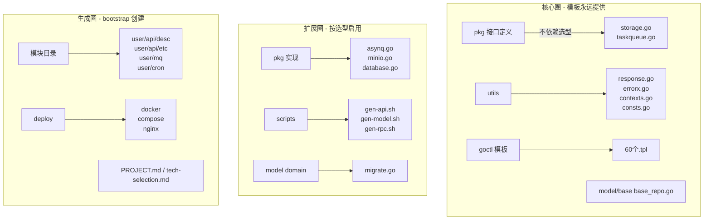

# 模板边界说明

本工作室的目录和文件分为三层。了解这三层的区别能让你一眼看出
"什么东西属于模板永远存在、什么东西需要我改、什么东西是启动项目后才生成"。

```
┌──────────────────────────────────────────────────────┐
│  Layer 1：永不改变（模板的规范层）                     │
│  克隆后不需要动，只需 AI agent 读取它们来约束行为      │
├──────────────────────────────────────────────────────┤
│  AGENTS.md / CLAUDE.md          规范真源 + Claude 桥接│
│  .agents/agents/* （8 个 agent 定义）                  │
│  .agents/skills/* （13 个工具型技能）|                   │
│  rules/*（10 份规范文档）                              │
│  .mcp.json / opencode.json / .codex/* / .pi/*（四端配置）│
│  LICENSE / .gitignore                 │
├──────────────────────────────────────────────────────┤
│  Layer 2：按需调整（模板的代码层）                     │
│  模板提供可编译的骨架，启动后根据选型确认细节           │
├──────────────────────────────────────────────────────┤
│  backend/go.mod                  module 占位 GOAI_MODULE│
│  backend/shared/pkg/             基础设施抽象接口（接口不动，实现按选型）│
│  backend/shared/utils/           工具包（直接可用）    │
│  backend/shared/goctl/           改造版 goctl 模板     │
│  backend/model/base/             BaseRepo 泛型 CRUD    │
│  backend/scripts/gen-*.sh        生成脚本              │
└──────────────────────────────────────────────────────┘

注意：
- Layer 2 中的文件在克隆后即「可编译」（go build pass），
  "可编译"≠"可直接运行"——部分代码（如 database 驱动、asynq 消费者）的
  具体实现由 bootstrap-project 按选型填充。
- GOAI_MODULE 是一个显式占位，启动运行时需要用 sed 替换为实际 module 前缀。
```

---

现在逐个分析四个议题。

---

## 议题#1: backend/ 该不该预建？——「核心圈+扩展圈」模型

### 当前状态
模板预建了 `backend/shared/` ~70% 的可编译代码。占位 `GOAI_MODULE` 让 go build 通过，
但部分代码（database 驱动、asynq consumer 的配置地址）在 bootstrap 之前不能运行。

### 分析结论
**预建是对的，但需要把「预建」显式分层，让用户一眼知道边界。**



### 改动建议
**核心圈（不改）。** `pkg/*.go` 接口定义、`utils/`、`goctl/`、`model/base/` 是模板的灵魂，
不依赖用户选型，永远存在。

**扩展圈改为选型后动态启用。** 当前 `asynq.go`、`minio.go`、`database.go` 预建了实现，
但 bootstrap 访谈后才确定是否启用：
- 选 PostgreSQL → `database.go` 填充 `openPostgres` 驱动；选 MySQL 则同理。
- 选 Asynq → taskqueue 的 Asynq 实现随业务代码一起生成。
- 不选队列 → taskqueue 只留接口不留实现。

**生成圈完全由 bootstrap 按选型生成。** 模块目录（`user/api/desc/...`）、deploy 物料、
PROJECT.md、tech-selection.md、`.env` 都应该由 `bootstrap-project` 动作创建。

### 当前差距
生成圈在 bootstrap 技能的描述中是存在的（"阶段 3：用 goctl 生成"），
但**没有精确到哪些操作具体由 AI 执行哪些步骤、哪些文件是 AI 调用 goctl 完成后自动落地的**。
当前技能仍偏笼统，需要把「步骤 2: 后端骨架」拆成更细粒度的"AI 操作清单"。

---

## 议题#2: 微服务拆分决策——缺失的能力

### 当前状态
tech-lead 有 `dispatch-dev`（派发）和 `spec-driven`（流程），**缺的是判断"该不该拆"的决策逻辑**。
当前唯一的约束在 `tech-stack-catalog.md` 里只有一行：

> 单体可平滑演进到微服务（module → service）

没有告诉 agent 什么条件下应该推进演进。

### 分析结论
**这是最明显的缺口。需要补充一个专门的决策技能 / reference。**

### 设计方案

补充 `rules/service-split-patterns.md`，包含四个核心维度：

```
1. 部署频率不一致
   - 模块 A 每周发布 3 次，模块 B 每月 1 次
   → 把 A 独立部署，不影响 B

2. 数据/并发量差异大
   - order 模块的 QPS 是 user 的 50 倍
   → order 独立扩容

3. 模块间出现循环依赖
   - user → order → payment → user
   → 先依赖重构（提取共享或引入 MQ），再按域拆分

4. 团队碰撞
   - 两个团队改同一个 go.mod
   → 按团队边界拆
```

并在 tech-lead 的绑定技能中加入引用：
```
项目规模增长后，tech-lead 应读 rules/service-split-patterns.md 评估拆分需要。
拆分的实际操作用 gozero-add-api / add-worker-task 完成。
```

---

## 议题#3: 模板边界——缺显式分层

### 当前状态
backend/ 编译通过、有 go.mod、有 go.sum。用户克隆下来之后会直觉认为
"这是一个可以跑的家伙"——但其实一部分不算（bootstrap 后才完整）。

### 分析结论
**需要在 README 和 AGENTS.md 中显式说明三层模型。**

已经在上面写了初版表格样式。下一步是把它落地到：
- `README.md` 作为"什么是 Layer 1 / 2 / 3"
- `bootstrap-project` 技能的 references 中作为"哪些文件我负责生成"
- `backend/README.md` 末尾作为"后端代码结构说明"

### 额外问题：go.mod 依赖的粒度
当前 `go.mod` 预装了 `asynq` 和 `minio-go`——这是扩展圈的依赖。
如果用户不选 Asynq，他们不应该需要 download `asynq` 的 indirect 依赖。
但 go.mod 现在有 `pre-req` 层的意思，`go mod tidy` 跑完后会全部拉到本地。

**评估：** 这不是严重问题。Go module 的 indirect 依赖占用极少（几 MB），
用户生成新模块后 `go mod tidy` 会自动去重。而且 pre-load 在 go.sum 里只占几百行，
在「模板便利性」和「依赖整洁」之间可以接受。

---

## 议题#4: deploy/ 的生成化

### 当前状态
`deploy/` 已简化为：`README.md（约束说明）` + `env/.env.example`。
先前预建的 `docker/`、`compose/`、`nginx/`、`k8s/`、`ci/` 已删除。

### 分析结论
**方向完全正确。但 `.env.example` 应该移到 `references/` 下作为模板，而非预置于根目录。**

原因：
- `.env.example` 包含 DB_HOST/REDIS_ADDR/STORAGE_ENDPOINT 等字段，
  这些值的具体内容依赖于 bootstrap 选型。预置会误导用户以为"配置已经就绪"。
- 作为 bootstrap-project 的 `references/env-template.md` 更合适——bootstrap 时 AI 读它并填充。

### 当前差距
bootstrap-project 的阶段 4 说"按选型生成 docker/compose/nginx"，但**没有具体说明
deploy/ 下的每个文件具体由 AI 的哪个步骤创建**。
deploy/ 现在因为简化而显得"能力单薄"，其实是正确的——约束在技能 + 数据在 references 中构建。

---

## 四步实施顺序建议

| # | 动作 | 影响 | 复杂度 |
|---|------|------|--------|
| 1 | 写 `rules/template-boundary.md`（三层模型）| 高（澄清所有困惑）| 低（新文件）|
| 2 | 写 `rules/service-split-patterns.md`（微服务拆分决策）| 中（补 tech-lead 能力缺）| 中 |
| 3 | bootstrap-project 阶段 3 拆成细粒度 AI 操作清单 | 高（让脚手架落到实处）| 中 |
| 4 | 将 `.env.example` 移入 bootstrap 的 references，deploy 只留 README | 低（清理偏差点）| 低 |

你认为这个方向和顺序是否认可？如果要开始，我按这个推进。
