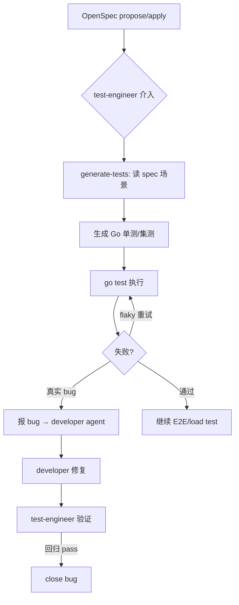

# Go 测试规范

本文件定义工作室 AI agent 生成和执行 Go 测试的规范。详见各测试技能（`generate-tests`、`e2e-runner`、`load-test`）的操作流程。

## 测试架构

| 层 | 工具 | 覆盖目标 | 文件后缀 |
|----|------|---------|---------|
| 单元测试 | `testing` + `testify` | logic 层纯逻辑，~70% | `_test.go` |
| 集成测试 | `testcontainers-go` | DB/Redis 真实交互，~20% | `_integration_test.go` |
| API 测试 | `httptest` + k6 | 接口契约与负载评估 | `*_test.go` / `.js` |
| E2E | Playwright | 浏览器关键用户流程 | `.spec.ts` |

## 单元测试（logic 层）

- **位置**：`{module}/api/internal/logic/*_test.go`，与 logic 同包（就近原则）。
- **模式**：table-driven + `t.Run` subtests。每行 = 一个场景（name + 输入 + 期望输出 + 期望错误）。
- **断言**：`testify/assert` 非致命断言，`testify/require` 致命（如 setup 失败）。
- **上下文**：Go 1.24+ 用 `t.Context()`。
- **mock**：简单接口用 `testify/mock`，复杂接口用 `gomock`。
- **目录结构**：
  - 测试 helper 放 `internal/logic/exports_test.go`（导出私有符号供测试用）。
  - 测试数据放 `testdata/{testname}/input.json`、`testdata/{testname}/expected.golden`。

```go
func TestCreateUser(t *testing.T) {
    type args struct { Name string; Email string }
    tests := []struct {
        name    string
        args    args
        wantErr bool
        wantMsg string
    }{
        {name: "正常创建", args: args{Name: "test", Email: "t@t.com"}, wantErr: false},
        {name: "邮箱重复", args: args{Name: "dup", Email: "t@t.com"}, wantErr: true, wantMsg: "email already exists"},
    }
    for _, tt := range tests {
        t.Run(tt.name, func(t *testing.T) {
            db := setupTestDB(t) // testcontainers
            repo := user.NewUserModel()
            svcCtx := &svc.ServiceContext{DB: db}
            l := NewCreateUserLogic(t.Context(), svcCtx)
            err := l.CreateUser(&types.CreateUserReq{Name: tt.args.Name, Email: tt.args.Email})
            if tt.wantErr {
                require.Error(t, err)
                assert.Contains(t, err.Error(), tt.wantMsg)
            } else {
                require.NoError(t, err)
            }
        })
    }
}
```

## 集成测试

- 用 `testcontainers-go` 启动独立容器（PostgreSQL/Redis），每测试 suite 共用一个容器。
- 文件名后缀 `_integration_test.go`，通过 build tag 隔离：`//go:build integration`。
- 运行：`go test -tags=integration -count=1 ./...`。
- 在 `TestMain` 中管理容器生命周期。

```go
//go:build integration

package logic

import (
    "context"
    "os"
    "testing"
    "github.com/testcontainers/testcontainers-go"
)

func TestMain(m *testing.M) {
    ctx := context.Background()
    pg, _ := testcontainers.GenericContainer(ctx, testcontainers.GenericContainerRequest{...})
    defer pg.Terminate(ctx)
    os.Exit(m.Run())
}
```

## API 测试

- 用 `httptest.NewServer` + `httptest.NewRecorder`（go-zero handler 本质是 `http.Handler`）。
- 验证状态码 200 + `body.code`（统一响应体规则：HTTP 统一 200，业务码读 body.code）。
- 路径与请求体对齐 `.api` 定义。

## E2E 测试（Playwright）

- 前端项目下的 `e2e/` 目录。
- 用 `data-testid` 属性定位元素，不依赖 CSS class。
- 测试前通过 API 创建/清理测试数据。
- 失败时自动截图和录屏。

## 负载测试（k6）

- 放 `backend/loadtest/` 目录，`.js` 文件。
- 场景类型：
  - `smoke.js` — 1-2 VU 验证基本功能。
  - `load.js` — 目标并发持续 N 分钟。
  - `stress.js` — 逐步增加至瓶颈。
  - `spike.js` — 短时间爆发。
- 阈值在 `options.thresholds` 中定义，与 PROJECT.md 非功能约束一致。

## 运行命令

```bash
# 单测
go test -race -count=1 -cover ./...

# 集测
go test -tags=integration -count=1 ./...

# k6
k6 run backend/loadtest/smoke.js --vus 1 --duration 10s

# Playwright
cd frontend && npx playwright test --reporter=list
```

## test-engineer agent 的所有技能触发逻辑


